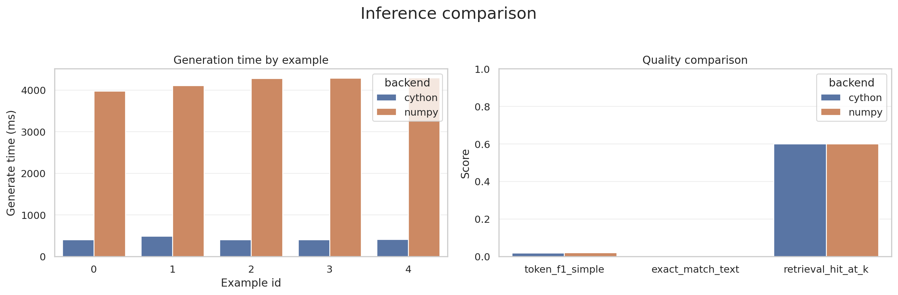
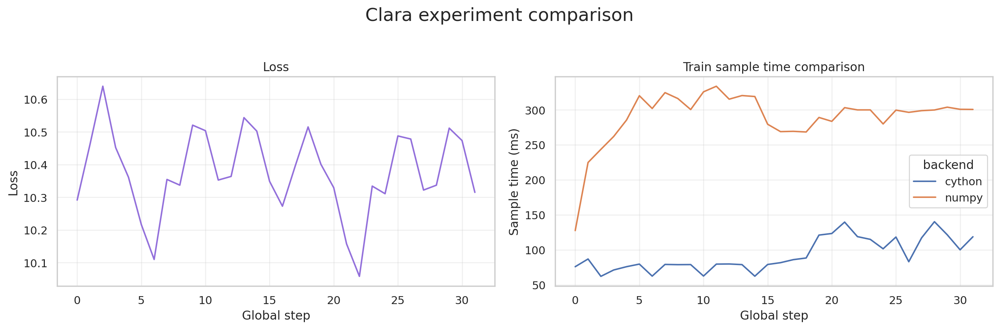
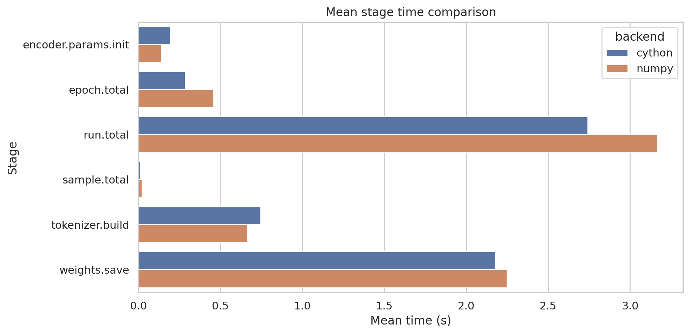
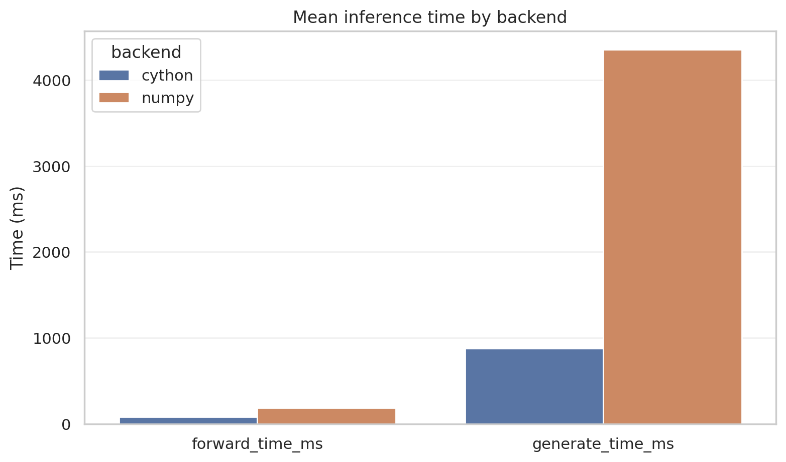

# CLaRiON

**C**ontinuous **L**atent **A**ugmented-**R**etrieval **I**nference **O**n **N**-cores

CPU-parallel reimplementation of the CLaRa architecture with:
- encoder pretraining,
- joint retrieval/generation training,
- NumPy and Cython backends,
- OpenMP acceleration,
- end-to-end benchmarking and profiling tools.

Authors: **Avner El Baz** (avner.el-baz@ensae.fr), **Paco Goze** (paco.goze@polytechnique.edu)
Feel free to reach out ! 

---

<p align="center">
  
  
  
</p>

<p align="center">
  
  
</p>

---

## Overview

CLaRiON reproduces the core CLaRa pipeline:

1. Transformer encoder
2. Embedding memory bank
3. Cosine retrieval
4. Differentiable top-k routing
5. Conditional text generation

The project also includes:
- standalone encoder pretraining,
- full joint training,
- NumPy vs Cython comparisons,
- profiling and performance reports.

Humans will build an entire retrieval architecture just to avoid admitting context windows are finite. Admirable species behavior.

---

## Features

- Tiny transformer encoder (`numpy` / `cython`)
- Parallel cosine retrieval
- Straight-Through differentiable top-k
- Joint retrieval + generation training
- Encoder cosine-regression pretraining
- OpenMP acceleration
- Benchmark suite
- Profiling utilities

---

## Installation

### Requirements

- Python 3.14+
- `uv`
- macOS: `libomp`

### Setup

```bash
# macOS only
brew install libomp

# Install dependencies
uv sync

# Build Cython extensions
uv run python setup.py build_ext --inplace

# Verify extensions
uv run python -c "from src.parallel import cython_encoder, cython_index, cython_topk; print('Cython OK')"
````

---

## Benchmarks

```bash id="a5v3vt"
# Encoder benchmark
uv run python -m src.benchmarks.bench_encoder

# Retrieval benchmark
uv run python -m src.benchmarks.bench_index

# Full pipeline benchmark
uv run python -m src.benchmarks.bench_pipeline

# Matmul benchmark
uv run python -m src.benchmarks.bench_matmul --include-large

# Backend consistency check
uv run python -m src.benchmarks.integration_check
```

Reports are written to `reports/*.json`.

---

## Encoder Pretraining

```bash id="n1v5le"
uv run -m src.train_encoder
```

Pretrains the encoder using cosine regression between query embeddings and support-document embeddings.

---

## Joint Training

```bash id="r5m5co"
uv run -m src.train_joint
```

Runs full retrieval + generation joint training with backend comparisons.

---

## Inference

```bash id="k49vqq"
uv run -m src.inference_examples
```

Runs generation examples and compares inference speed and retrieval quality.

---

## Profiling

```bash id="csm6zc"
# Pipeline flamegraph
scripts/profile.sh bench_pipeline

# Alternative profilers
PROFILER=austin   scripts/profile.sh bench_pipeline
PROFILER=cprofile scripts/profile.sh bench_pipeline
```

Because eventually every ML project becomes a profiling project with extra steps.

---

## Project Structure

```text id="glk3vd"
src/
├── models/
├── index/
├── parallel/
├── benchmarks/
├── data/
├── encoder_pretrain.py
├── train_joint.py
├── inference_examples.py
└── setup.py
```

---

## Implementation Notes

* OpenMP parallelism via `prange`
* Shared weights across NumPy and Cython backends
* Comparable outputs across implementations
* Automatic benchmark reporting
* Full training checkpoints

---

## References

* CLaRa paper: *Continuous Latent Augmented Retrieval Inference*
* Apple reference implementation:
  [https://github.com/apple/ml-clara](https://github.com/apple/ml-clara)

```

